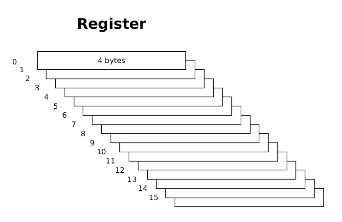
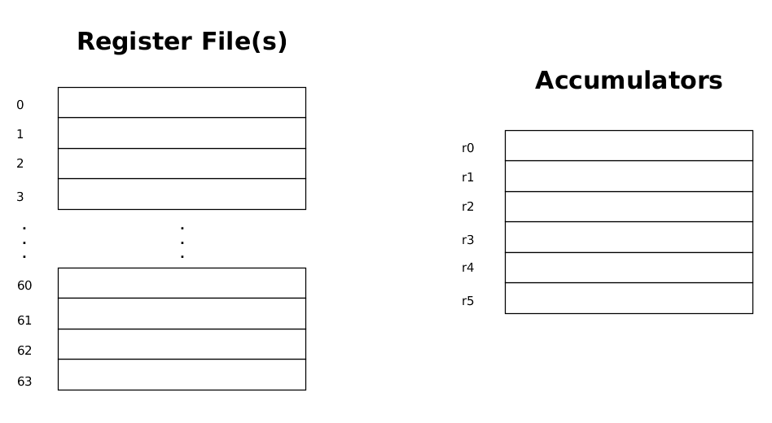
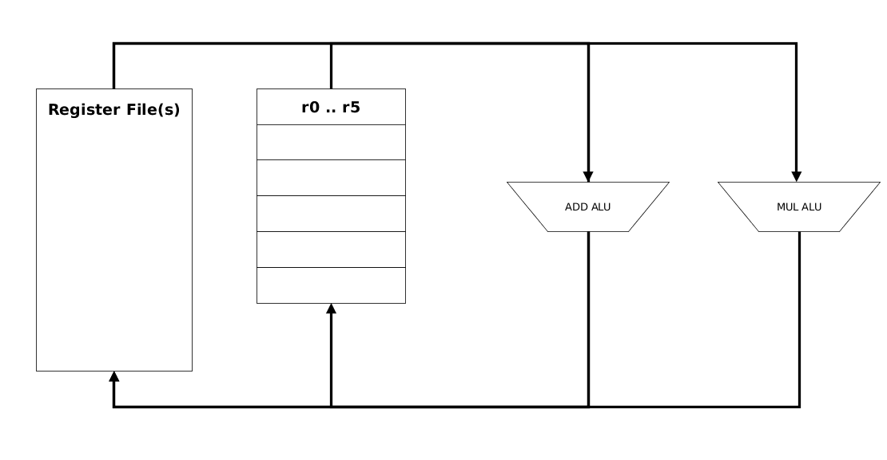
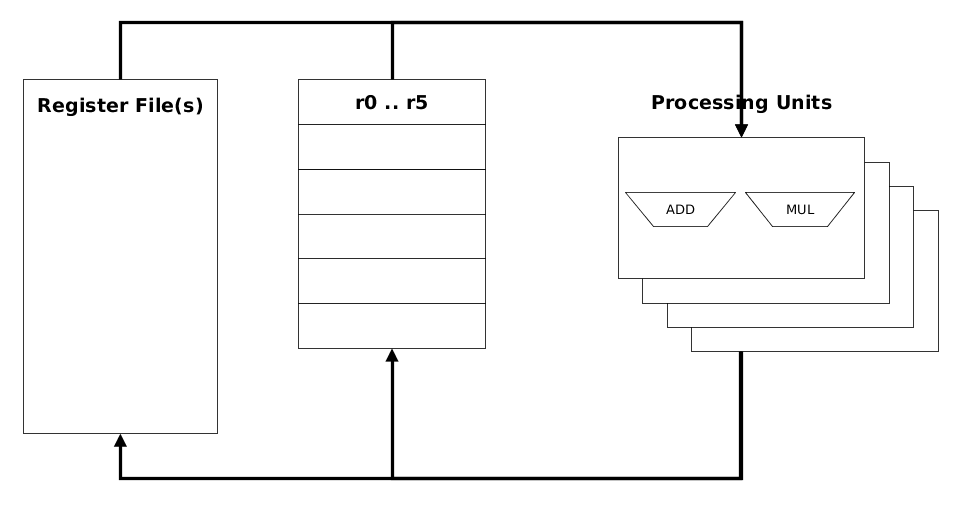
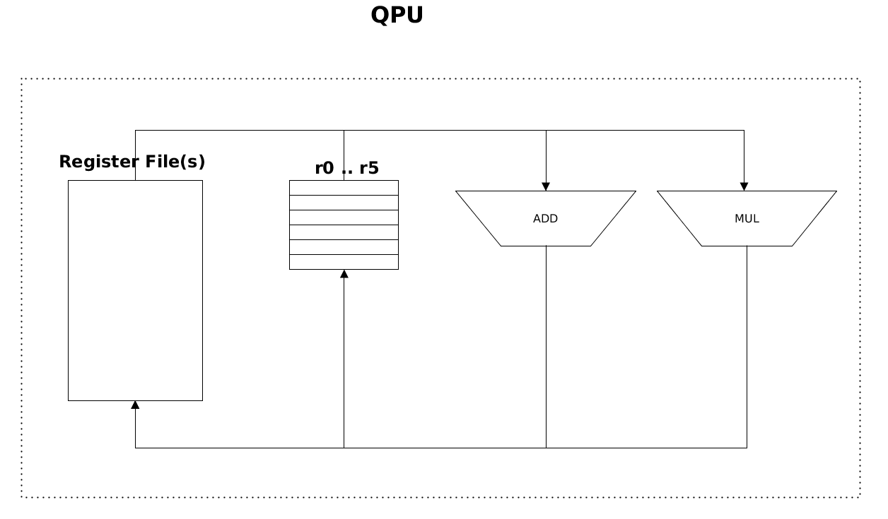
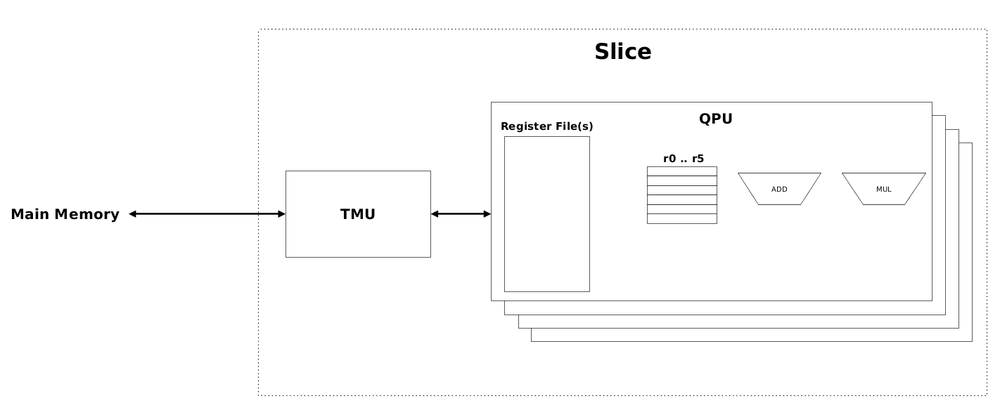
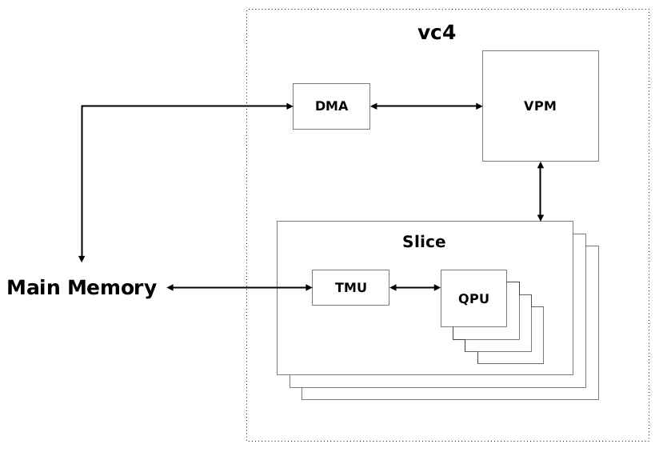

<head>
	<link rel="stylesheet" type="text/css" href="css/docs.css">
</head>

# VideoCore Basics - What you need to know

In order to effectively program on the `VideoCore`, you need a working model of its functionality
in your head. This document describes the bare minimum you need to know.

## Registers

The basic storage location within the VideoCore is a register. It is a 32-bit wide location which
in the majority of cases contains an integer or float value.

The *single most important thing* to wrap your brain around is that a register is also **16 values deep**.
A single register represents 16 distinct values.

Within the project, this stack of 16 32-bit wide values is called a **16-vector**, or **vector** for short.

A single instruction working on registers, will perform the operation on *all* register values, pairing
the elements by their position and working on each pair.

### Vector Arithmetic

For example, an add operation working on two registers `RF0` and `RF1`:

    add RF0, RF0, RF1      // first operand is destination
	
with:

    RF0 = <10 11 12 13 14 15 16 17 18 19 20 21 22 23 24 25>
    RF1 = <20 21 22 23 24 25 26 27 28 29 30 31 32 33 34 35>

...will result in `RF0` having a value:

    RF0 = <30 32 34 36 38 40 42 44 46 48 50 52 54 56 58 60>

Every location in the vector has an associated offset, which in the source language code can be
specified with **index()**. For example:

    Where (index() < 8)
      RF0 = 2;
    End
   
...will set locations 0..7 to value 2 in register `RF0`. The remaining locations will be unchanged.
So the previous `RF0` will become:

    RF0 = <2 2 2 2 2 2 2 2 46 48 50 52 54 56 58 60>

For an overview of operations specific for handling vectors, see
[Vector Operations](#vector-operations)

## Register Files

There are 64 general registers organized in one or two **register files**. `vc4` has two register files
A and B, each containing 32 registers, `v3d` has a single register file with 64 registers.

In addition, there are 6 **accumulators**, dubbed `r0` to `r5`. Usage of these can improve the
efficiency of the operations, especially for `vc4`. `r4` and `r5` have specific usage for IO and
some extended operations.

**NOTE: Accumulators have been dropped on `vc7`.**

## Arithmetic Logic Units

Logically, there are two ALUs associated with the registers, the **Add ALU** and the **Mul ALU**.
They each have a set of different operations they can perform.
Input values are read from the registers, processed, and the output is again stored in a register.

The naming comes from the fact that, originally, the Add ALU
performed the addition operations and the Mul ALU performed the multiplication operations.
On `v3d`, this is not true any more; the Mul ALU can also do addition.

The ALUS work independently and execute in parallel. By combining operations,
the performance can be improved by using the Add and Mul ALUs simultaneously.

## Processing Units

At the risk of complicating the simple model, I will take it one step deeper.

Instead of one Add and one Mul ALU, there are actually four **processing units** that perform the ALU operations.

The processing units perform the same operation in parallel, but they work on different elements of the handled 16-vectors.
Each processing unit operates on one index offset of the 16-vectors per go. This takes one clock cycle.
So, per clock cycle, four indexes are handled, and it takes four clock cycles to process all used 16-vectors.

In practise, this is completely transparent and you do not need to take it into account while programming.
Retaining a model with one Add and one Mul ALU is sufficient.
Regard it as an explanation for why ALU operations take four clock cycles.

## Quad Processing Unit (QPU)

The basic hardware unit in the VideoCore is called a **Quad Processing Unit (QPU)**.
The name comes from the fact that each unit contains four processing units performing the operations.

There are multiple QPUs present in the VideoCore, `vc4` has 12 and `v3d` has 8.
The reason that `v3d` is faster anyway is largely due to hardware improvements.

QPUs operate totally independently, even if they are executing the same program.
In theory, it is possible that they execute different programs in parallel.
In practise, they each can take a different path through a given program.

Every QPU has an associated index, which in the source language code can be
obtained with **me()**. In addition, the number of running QPUs per program is given by **numQPUs()**.
These can be used to distribute a given calculation over multiple QPUs.

For example, consider a two-dimensional array, of which each row is processed by one QPU.
The following loop can be specified:

    For (Int row = me(), row < row_size, row += numQPUs())
	  // Do something useful per row
	End

## Slices and TMU

The QPUs are organized into **slices**. Each slice contains four QPUs.

`vc4` has three slices, `v3d` has two.

A slice has additional functionality, shared by the QPUs within the slice.
The important bit for our purposes is the **Texture and Memory Lookup Unit (TMU)**, which fetches and stores values to/from main memory.
The name implies that it is used for textures, but any kind of value can be fetched and stored.

The TMU is a FIFO buffer for memory lookups. You specify the addresses of the values you want and
do a fetch request.
The values are stored sequentially in the TMU and are read in the order they are fetched.

TMU fetch operates independently from the QPUs. It is possible to prefetch values, do some
calculations on the QPUs and load the values after. This is a neat way to increase throughput.

On `vc4`, the TMU is *read-only*. On `v3d`, you can also do TMU writes.

-----

**Unfortunately, there are differences between `vc4` and `v3d` which you must be aware of. The following two sections name the two most essential ones.**

## DMA/VPM memory fetch and store (`vc4` only)

The **Vertex Pipe Memory (VPM)** is a data buffer *shared by all QPUs*.

In order to use it for loads, you first issue a DMA request to put data into the VPM.
Afterwards, the QPUs query the VPM to load the data.
A store works similar in reverse order.

A single DMA read and a single DMA write can be performed in parallel with QPU operations.
Multiple DMA reads need to wait for previous reads to complete; the same is true for DMA writes.

Since `vc4` can not do TMU writes, this is the way to store data.
It is, unfortunately, intricate and has quite a bit of overhead for performing the DMA/VPM operations.

DMA/VPM reads have the potential to be faster that TMU reads for large chunks of data.
In regular use, however, TMU is faster.

## Cores (`v3d` only)

On `v3d`, the slices are organized into **cores**.
There are two slices per core, `v3d` has a single core.

-----

## Performance Optimizations

In general, there are three great ways to improve performance and throughput on VideoCores:

1. Prefetch values using the TMU
2. Use multiple QPUs for a given calculation
3. Use the Add and Mul ALUs simultaneously

Combining these results in a program running on a Pi which tears my Intel i7 to shreds.

*(...okay, let's be honest about this: single thread, CPU only, no SSE. In this case, the i7 is eating dust)*

-----

#  Vector Operations 

## Vector Offsets

In a kernel, when loading values in a register in a manner that would be considered intuitive for a programmer:

    Int a = 2;

...you end up with a 16-vector containing the same values:

    a = <2 2 2 2 2 2 2 2 2 2 2 2 2 2 2 2>

In order to use the vector processing capabalities effectively, you want to be able to perform
the calculations with different values.

The following functions at source code level are supplied to deal this:

### Function `index()`

Returns an index value unique to each vector element, in the range `0..15`.

The following user-level code:

    Int a = index();

Results in: 

    a = <0 1 2 3 4 5 6 7 8 9 10 11 12 13 14 15>

### Function `me()`

Returns an index value unique to each QPU participating in a calculation.
A single running QPU would have `me() == 0`, any further QPU's are indexed sequentially.

### Function `numQPUs()` 

Returns  number of QPU's participating in a calculation.

The possible values depend on the VideoCore used:

- `vc4`: 1...12
- `vc6`: 1 or 8
- `vc7`: 1...16

### Vector offset calculation

The previous functions are useful to differentiate pointers to memory addresses.
The following is a method to load in consective values from shared main memory:

    void kernel(Ptr<Int> x) {
      x = x + index();
      a = *x;
    }

*Keep in mind that Int and Float values are 4 bytes. Pointer arithmetic takes this into account.*

The incoming value `x` is a pointer to an address in shared memory (i.e. accessible by both the CPU and the QPU's).
By adding `index()`, each vector element of `x` will point to consecutive values.
On the assignment to `a`, these consecutive values will be loaded into the vector elements of `a`.

When using multiple QPUs, you could load consecutive blocks of values into separate QPUs int the following way:

    void kernel(Ptr<Float> x) {
      x = x + index() + (me() << 4);
      a = *x;
    }

## Automatic Uniform Pointer Initialization

Adding `index()` to uniform pointers is so common in kernel code, that I made the following design decision:

**All uniform pointers are initialized with an index offset**

This means that if a parameter `Int::Ptr ptr` is passed into a kernel with an assigned memory address value `addr`,
It will be initialized as:

    ptr = <addr addr+4 addr+8 addr+12 addr+16 addr+20 addr+24 addr+28 addr+32 addr+36 addr+40 addr+44 addr+48 addr+52 addr+56 addr+60>

You are free to adjust the offsets as required in your application.
A nice example is **Cursors**.

If you really need a single address in the code, do the following in the kernel:

    ptr -= index();

