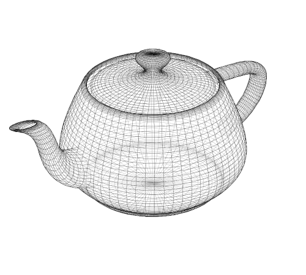
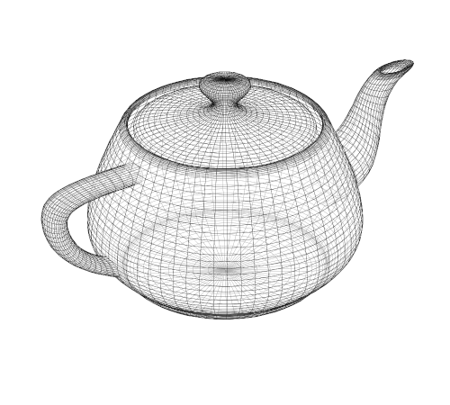
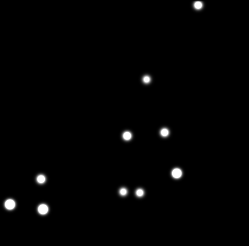
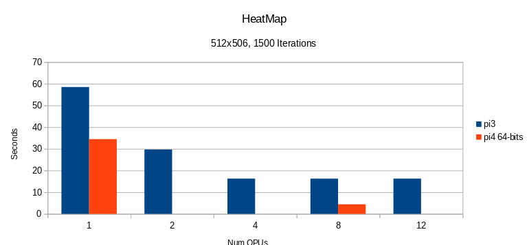

[//]: # (Construct `` is used to disambiguate internal links)
[//]: # (This is not required for unambiguous links, `markdown` and/or `gitlit` can deal with these)
<head>
	<link rel="stylesheet" type="text/css" href="css/docs.css">
</head>

# Examples

## Contents

* [Overview of Examples](#overview-of-examples)
* [Example 1: Euclid's Algorithm](#example-1-euclids-algorithm)
    * [Scalar version](#scalar-version)
    * [Vector version 1](#vector-version-1)
    * [Invoking the QPUs](#invoking-the-qpus)
    * [Vector version 2: loop unrolling](#vector-version-2-loop-unrolling)
* [Example 2: 3D Rotation](#example-2-3d-rotation)
    * [Scalar version](#scalar-version-1)
    * [Vector version 1](#vector-version-1-1)
    * [Vector version 2: non-blocking memory access](#vector-version-2-non-blocking-memory-access)
    * [Performance](#performance)
* [Example 3: 2D Convolution (Heat Transfer)](#example-3-2d-convolution-heat-transfer)
    * [Scalar version](#scalar-version-2)
    * [Vector version](#vector-version)
    * [Performance](#performance-1)

## Overview of Examples

- **GCD**       - [Euclid's algorithm](https://en.wikipedia.org/wiki/Euclidean_algorithm), The GCD's of some random pairs of integers
- **Tri**       - Computes [triangular numbers](https://en.wikipedia.org/wiki/Triangular_number), using two kernels:
  1. with integer in- and output
  2. with float in- and output
- **HeatMap**   - Modelling heat flow across a 2D surface; outputs an image in [pgm](http://netpbm.sourceforge.net/doc/pgm.html) format, and notes the time taken
- **Rot3D**     -  3D rotation of a random object; outputs the time taken

## Example 1: Euclid's Algorithm

Given a pair of positive integers larger than zero, 
[Euclid's algorithm](https://en.wikipedia.org/wiki/Euclidean_algorithm).
computes the largest integer that divides into both without a
remainder, also known as the *greatest common divisor*, or GCD for
short.

We present two versions of the algorithm:

  1. a **scalar** version that runs on the ARM CPU and computes a
     single GCD; and

  2. a **vector** version that runs on a single QPU and computes 16
     different GCDs in parallel.

### Scalar version

In plain C++, we can express the algorithm as follows.

    void gcd(int* p, int* q, int* r) {
      int a = *p;
      int b = *q;
    
      while (a != b) {
        if (a > b) 
          a = a-b;
        else
          b = b-a;
      }
      *r = a;
    }

Admittedly, it's slightly odd to write `gcd` in this way, operating
on pointers to integers rather than integers directly.  However, it
prepares the way for the vector version which operates on 
*arrays* of inputs and outputs.

### Vector version 1

Using `V3DLib`, the algorithm looks as follows.

    void gcd(Int::Ptr p, Int::Ptr q, Int::Ptr r) {
      Int a = *p;
      Int b = *q;
    
      While (any(a != b))
        Where (a > b)
          a = a-b;
        End
        Where (a < b)
          b = b-a;
        End
      End
    
      *r = a;
    }

This example introduces a number of concepts:

  * the `Int` type denotes a 16-element vector of 32-bit integers;
  * the `Int::Ptr` type denotes a 16-element vector of *addresses* of
    `Int` vectors;
  * the expression `*p` denotes the `Int` vector in memory starting at address
    <tt>p0</tt>, i.e. starting at the *first* address in the
    vector `p`;
  * the expression `a != b` computes a vector of booleans via a 
    pointwise comparison of vectors `a` and `b`;
  * the condition `any(a != b)` is true when *any* of the booleans in the
    vector `a != b` are true;
  * the statement `Where (a > b) a = a-b; End` is a conditional assigment:
    only elements in vector `a` for which `a > b` holds will be
    modified.

### Invoking the QPUs

The following program computes 16 GCDs in parallel on a single QPU:

    int main(int argc, const char *argv[]) {
      settings.init(argc, argv);
    
      auto k = compile(gcd);                 // Construct the kernel
    
      Int::Array a(16), b(16), r(16);        // Allocate and initialise the arrays shared between ARM and GPU
      srand(0);
      for (int i = 0; i < 16; i++) {
        a[i] = 100 + (rand() % 100);
        b[i] = 100 + (rand() % 100);
      }
    
      k.load(&a, &b, &r);                    // Invoke the kernel
      settings.process(k);
    
      for (int i = 0; i < 16; i++)           // Display the result
        printf("gcd(%i, %i) = %i\n", a[i], b[i], r[i]);
      
      return 0;
    }

Explanation:

  * `compile()` takes a function defining a QPU computation and returns a
    CPU-side handle that can be used to invoke it;
  * the handle `k` is of type `Kernel<Int::Ptr, Int::Ptr, Int::Ptr>`,
    capturing the types of `gcd`'s parameters,
    but we use the `auto` keyword to avoid clutter;
  * when the kernel is invoked by writing `k(&a, &b, &r)`, `V3DLib` 
    automatically converts CPU values of type
    `Int::Array*` into QPU values of type `Int::Ptr`;
  * Type `Int::Array` is derived  from `SharedArray<>` which is used to allocate
    memory that is accessible by both the CPU and the QPUs.
    memory allocated with `new` and `malloc()` is not accessible from the QPUs.

Running this program produces the output:

    gcd(183, 186) = 3
    gcd(177, 115) = 1
    gcd(193, 135) = 1
    gcd(186, 192) = 6
    gcd(149, 121) = 1
    gcd(162, 127) = 1
    gcd(190, 159) = 1
    gcd(163, 126) = 1
    gcd(140, 126) = 14
    gcd(172, 136) = 4
    gcd(111, 168) = 3
    gcd(167, 129) = 1
    gcd(182, 130) = 26
    gcd(162, 123) = 3
    gcd(167, 135) = 1
    gcd(129, 102) = 3

### Vector version 2: loop unrolling

[Loop unrolling](https://en.wikipedia.org/wiki/Loop_unrolling){:target="_blank"} is a
technique for improving performance by reducing the number of costly
branch instructions executed.

The QPU's branch instruction is costly: it requires three
[delay slots](https://en.wikipedia.org/wiki/Delay_slot){:target="_blank"} (that's 12 clock cycles),
and this project currently makes no attempt to fill these slots with useful work.
Although loop unrolling is not done automaticlly,
it is straightforward use a C++ loop to generate multiple QPU statements.

    void gcd(Int::Ptr p, Int::Ptr q, Int::Ptr r) {
      Int a = *p;
      Int b = *q;
      While (any(a != b))
        // Unroll the loop body 32 times
        for (int i = 0; i < 32; i++) {
          Where (a > b)
            a = a-b;
          End
          Where (a < b)
            b = b-a;
          End
        }
      End
      *r = a;
    }

## Example 2: 3D Rotation

This example illustrates a routine to rotate 3D objects.

([OpenGL ES](https://www.raspberrypi.org/documentation/usage/demos/hello-teapot.md){:target="_blank"}
is probably a better idea for this if you need to rotate a lot.
This example is just for illustration purposes)

If this is applied to the vertices of
[Newell's teapot](https://github.com/rm-hull/newell-teapot/blob/master/teapot){:target="_blank"}[^1];

[^1]: rendered using [Richard Hull's wireframes](https://github.com/rm-hull/wireframes){:target="_blank"} tool

|  |  |
|:---:|:---:|
| &theta; = 0&deg; | &theta; = 180&deg; |

`Rot3D` profiling for the several kernels which were present can be found [here](Profiling/Rot3D.html).

### Performance

The profiling for `Rot3D` has been updated and moved to [Rot3D Profiling](Profiling/Rot3D.html).

## Example 3: 2D Convolution (Heat Transfer)

This example models the heat flow across a 2D surface.
[Newton's law of cooling](https://en.wikipedia.org/wiki/Newton%27s_law_of_cooling)
states that an object cools at a rate proportional to the difference
between its temperature `T` and the temperature of its environment (or
ambient temperature) `A`:

    dT/dt = −k(T − A)

In the simulation, each point on the 2D surface to be a separate object,
and the ambient temperature of each object to be the average of the temperatures of the 8 surrounding objects.
This is very similar to 2D convolution using a mean filter.

The `HeatMap` example program initializes a number of heat points and then
iteratively calculates the diffusion.
The following images show what happens with progressive iterations:

|  |  |  |
|:---:|:---:|:---:|
| 0 steps | 100 steps | 1500 steps |

###  Scalar Version

The following function simulates a single time-step of the
differential equation, applied to each object in the 2D grid.

    void scalar_step(float** map, float** mapOut, int width, int height) {
      for (int y = 1; y < height-1; y++) {
        for (int x = 1; x < width-1; x++) {
          float surroundings =
            map[y-1][x-1] + map[y-1][x]   + map[y-1][x+1] +
            map[y][x-1]   +                 map[y][x+1]   +
            map[y+1][x-1] + map[y+1][x]   + map[y+1][x+1];
          surroundings *= 0.125f;
          mapOut[y][x] = (float) (map[y][x] - (K * (map[y][x] - surroundings)));
        }
      }
    }

### Kernel Version

The kernel program uses a **cursor** to iterate over the values.
The cursor implementation for `HeatMap` preloads and iterates over three consecutive lines simultaneously.
This allows for a kernel program to access all direct neighbors of a particular location.

Conceptually, you can think of it as follows:

                   prev     current    next
    columns:       i - 1       i       i + 1
                +---------+---------+---------+
    line j -1   |         |         |         |
                +---------+---------+---------+
    line j      |         | (i , j) |         |
                +---------+---------+---------+
    line j + 1  |         |         |         |
                +---------+---------+---------+

Keep in mind, though, that in the implementation every cell is actually a 16-vector,
and represents 16 consecutive values.

For the kernel program, a 1D-array with a width offset ('pitch') is used to implement the 2D array.
The kernel simulation step using cursors is expressed below (taken from example `HeatMap`).

    /**
     * Performs a single step for the heat transfer
     */
    void heatmap_kernel(Float::Ptr map, Float::Ptr mapOut, Int height, Int width) {
      Cursor cursor(width);
    
      For (Int offset = cursor.offset()*me() + 1,
           offset < height - cursor.offset() - 1,
           offset += cursor.offset()*numQPUs())
    
        Float::Ptr src = map    + offset*width;
        Float::Ptr dst = mapOut + offset*width;
    
        cursor.init(src, dst);
    
        // Compute one output row
        For (Int x = 0, x < width, x = x + 16)
          cursor.step([&x, &width] (Cursor::Block const &b, Float &output) {
            Float sum = b.left(0) + b.current(0) + b.right(0) +
                        b.left(1) +                b.right(1) +
                        b.left(2) + b.current(2) + b.right(2);
    
            output = b.current(1) - K * (b.current(1) - sum * 0.125);
    
            // Ensure left and right borders are zero
            Int actual_x = x + index();
            Where (actual_x == 0)
              output = 0.0f;
            End
            Where (actual_x == width - 1)
              output = 0.0f;
            End
          });
        End
    
        cursor.finish();
      End
    }

###  Performance

Times taken to simulate a 512x506 surface for 1500 steps:

| Pi version | Kernel | Number of QPUs | Run-time (s) | Notes |
| ---------- | -------| -------------: | -----------: | ----- |
| Pi4        | Scalar |  0             | 17.63        ||
|            | Vector |  1             | 34.45        | Slower than scalar! |
|            | Vector |  8             |  4.43        |
| Pi3        | Scalar |  0             | 75.61        ||
|            | Vector |  1             | 58.48        ||
|            | Vector |  2             | 29.67        ||
|            | Vector |  4             | 16.26        ||
|            | Vector |  8             | 16.24        | No more improvement|
|            | Vector | 12             | 16.25        ||

--------------------------
