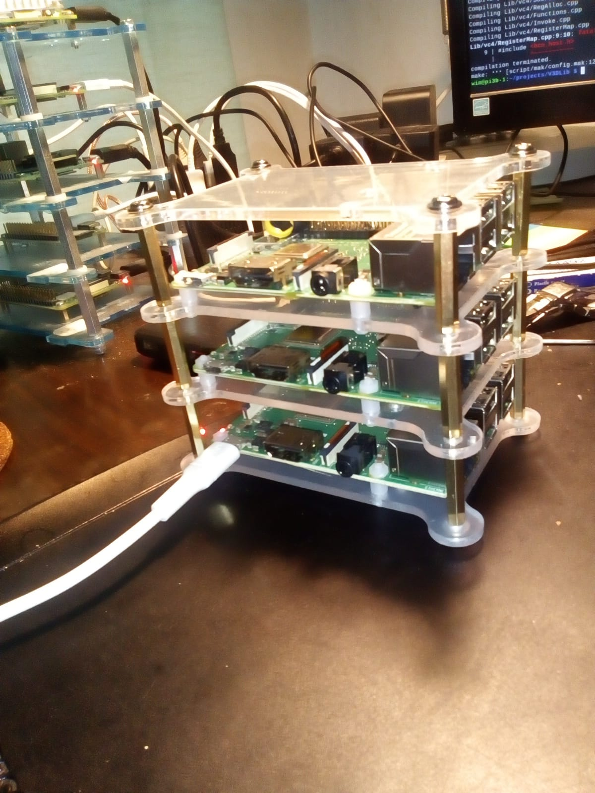

<head>
	<link rel="stylesheet" type="text/css" href="css/docs.css">
</head>

# VideoCore Basics

There are three distinct versions of the `VideoCore` GPU:

- **VideoCore IV**  - Used on all Pi's prior to the `Pi4`, and on the `Zero` 
- **VideoCore VI**  - Used on The `Pi4`
- **VideoCore VII** - Used on The `Pi5`

To see the differences between the VideoCores, see the [Changes Page](Changes.md).

The basic hardware unit in the VideoCore is the **Quad Processing Unit (QPU)**.

- The `Pi4` has 8 QPU's 
- The `Pi5` has 16
- All other Pi's have 12

Due to the hardware improvements, the `Pi4` GPU is still faster than in previous versions of the Pi.  
Performance-wise, the `Pi5` absolutely destroys all previous models.

To get an idea of what VideoCore programming looks like, please view the [Basics Page](Basics.md).

# Supported Pi's

Unit tests are run regularly on the following Pi versions:

| Pi Version | Model | Register Size | Debian version | Memory | VideoCore | Model Number | Revision |
|-------|----------------------|-----------|---------------|--------|-----|--------------|----------|
| Pi5   | Model B Rev 1.0      | 64        | 12 (bookworm) | 4GB    | vc7 | BCM2835      | c04170   |
| Pi4   | Model B Rev 1.1      | 64        | 12 (bookworm) | 2GB    | vc6 | BCM2711      | b03111   |
| Pi3   | Model B Plus Rev 1.3 | 64        | 13 (trixie)   | 1GB    | vc4 | BCM2837      | a020d3   |
| Pi3   | Model B Rev 1.2      | 32        | 10 (buster)   | 1GB    | vc4 | BCM2837      | a02082   |
| Zero  | W Rev 1.1            | 32        | 12 (bookworm) | 0.5GB  | vc4 | BCM2835      | 9000c1   |
| Pi2   | Model B Rev 1.1      | 32        | 12 (bookworm) | 1GB    | vc4 | BCM2836      | a01041   |
| Pi1   | Model B Rev 2        | 32        | 12 (bookworm) | 0.5GB  | vc4 | BCM2835      | 000e     |

The notable omissions in this list:

- **Raspberry PI Pico**: This is a microcontroller. Can't run Debian, has no VideoCore. 
- **Raspberry PI Compute Modules**: As far as I can tell, these are Pi's in sexy casings.
	I will buy them eventually, but currently I don't see the point.

# Personal Notes/Gripes

- The QPUs are part of the Raspberry Pi's graphics pipeline.  If you're
interested in doing cool graphics on the Pi then you probably want **OpenGL ES**.
The added value of `V3DLib` is _accelerating non-graphics parts_ of your Pi projects.
- `V3DLib` **does not implement multi-threading** on the QPU level and never will.
The complexity is not worth it IMHO, and the benefits dubious.
I believe that there is no performance gain to be found here, quite the contrary. 
- `V3DLib` **is not thread-safe**.
  In particular, function `compile()` is used to compile a kernel from a class generator definition into
  a format that is runnable on a QPU. This uses *global* heaps internally for e.g. generating
  the AST and for storing the resulting statements. Because the heaps are global, running
 `compile()` parallel on different threads will lead to problems.
- The user-level language is an [Embedded Domain Specific Language](https://wiki.c2.com/?EmbeddedDomainSpecificLanguage).
  There are no pre-processors being used other than the standard C pre-processor.
  The output is standard C++ code.
- Kernel programs are compiled dynamically, so that a given program can run unchanged on any version  of the RaspBerry Pi.
  The kernels are generated inline and offloaded to the GPU's at runtime.

# <a name="conventions">Conventions</a>

The following naming is used within the project:

- The `VideoCore IV` is referred to as `vc4`,
- The `VideoCore VI` as `vc6`,
- The `VideoCore VII` as `vc7`.
- `vc6` and `vc7` are collectively referred to as `v3d`[^1]. 

[^1]: This comes from the Mesa library. `vc6` and `vc7` are handled by a common driver called `v3d`.

- The earliest Debian version supported is **Debian 10 Buster**.
- 32-bits continues to be supported. This is required for the early PI's and `Zero`.
- The C++ code is currently compiled with language version `c++17`[^2]. 
- Indent is two spaces. Not because I want it to (I vastly prefer tabs), but because `github`
  otherwise makes a mess of the source display, especially when tabs and spaces are mixed.
- A program running on a VideoCore is named a [(compute) kernel](https://en.wikipedia.org/wiki/Compute_kernel).
	I leave out 'compute' when describing kernels.
  This is different from the Broadcomm and Mesa terminology, where programs are called **shaders**.
- A naming convention which has grown historically:
  * **scalar kernel** - A kernel written in standard C++, runs on CPU. 'scalar' for short.
  * **vector kernel** - A kernel written to run on the QPU's. 'kernel' for short.
- Values passed from a CPU program into a kernel are called *uniform values* or **uniforms**.
  Their usage is totally comparable to command-line parameters for a console app.
- Any method or function which generates debug output is named `dump()` (or uses `dump` as prefix).
  The utility of this is obvious when you use `dbg` a lot.

[^2]: There is no overriding reason to hold on to this, give me a good reason and I will happily up the C++ version.

-------------------

# Specifications 

This is an overview for the easily comparable stuff:

| Pi Version | CPU # Cores |CPU Clock (Mhz) | GPU Clock (Mhz) | VideoCore version | Wifi | Ethernet |
|------------|-------------|----------------|-----------------|-------------------|------|----------|
| **Pi1**    | 1           |  700           | 250             | vc4               | no   | yes      |
| **Pi2**    | 4           |  900           | 250             | vc4               | no   | yes      |
| **Zero**   | 1           | 1000           | 300             | vc4               | yes  | **no**   |
| **Pi3**    | 4           | 1200           | 300             | vc4               | yes  | yes      |
| **Pi3B+**  | 4           | 1400           | 300             | vc4               | yes  | yes      |
| **Pi4**    | 4           | 1500           | 500             | vc6               | yes  | yes      |
| **Pi5**    | 4           | 2400           | 960             | vc7               | yes  | yes      |

The clock frequencies for both CPU and GPU are variable. The given values are the maximum values.

[Useful commands](Notes.html#useful-commands) for obtaining this information.

## GPU Stuff

| Item                 | vc4             | vc6              | vc7             | Comment |
|----------------------|-----------------|------------------|-----------------|---------|
| **Num QPU's:**       | 12              | 8                | 16              |         | 
| **Register Files**   | 2x32            | 1x64             | 1x64            |         |
| **Data Transfer**    |                 |                  |                 |         |
| DMA                  | read/write      | *not supported*  | *not supported* |         |
| VPM                  | read only       | read/write       | read/write      |         |
|                      |                 |                  |                 |         |
| _Following not verified for vc7_ |     |                  |                 |         |
| **TMU gather limit:**|  4              | 8                | | The maximum number of concurrent prefetches before QPU execution blocks |
| **Threads per QPU**  |                 |                  | | *Shows num available registers in register file per thread* |
| 1 thread             | 64 registers    |  *not supported* | |
| 2 threads            | 32 registers    | 64 registers     | |
| 4 threads            | *not supported* | 32 registers     | |

- Why is the TMU gather limit set here for `vc6`? DMA was dropped.

# Compile times on all Pi's

To give you an idea of how long full compilation takes,
the following commands are used (20260207):

    > git pull
    > make clean
    > time make all runTest

Results per platform, time in seconds (timing varies a lot! Following is indicative);

| Platform | real (s) |
|----------|----------|
| Pi-1     | 6903     |
| Zero     | 4288     |
| Pi-2     | 1914     |
| Pi-3     | 1011     |
| Pi-3B+   |  879     |
| Pi-4     |  795     |
| Pi-5     |  130     |

I should update for all platforms periodically, code is changing continuously.

-----

# Calculated theoretical max FLOPs

Let's be honest, the max FLOPs is totally unattainable in real life...

From the [VideoCore® IV 3D Architecture Reference Guide](https://docs.broadcom.com/doc/12358545):

- The QPU is a 16-way SIMD processor.
- Each processor has two vector floating-point ALUs which carry out multiply and non-multiply operations in parallel with single instruction cycle latency.
- Internally the QPU is a 4-way SIMD processor multiplexed 4× (over PPU's) over four cycles, making it particularly suited to processing streams of quads of pixels.

So:

- 4 operations per clock cycle, when properly pipelined
- 2 ALU's per operation, when instructions use both

So, calculation:

    op/clock per QPU = 4 [PPU's] x 2 [ALU's] = 8
    GFLOPs           = [Clock Speed (MHz)]x[num slices]x[qpu/slice]x[op/clock]
                     = [Clock Speed (MHz)]x[num qpu's]x[op/clock]
    
    Pi1  : 250x12x8 =  24.0 GFLOPs
    Pi2  : 250x12x8 =  24.0 GFLOPs
    Pi3  : 300x12x8 =  28.8 GFLOPs
    Zero : 300x12x8 =  28.8 GFLOPs
    Pi3+ : 400x12x8 =  38.4 GFLOPs  # Could be 300; used judiciously, it can be faster than the Pi4
    Pi4  : 500x 8x8 =  32.0 GFLOPs  # Less! The improved hardware in `v3d` compensates.
    Pi5  : 960x16x8 = 122.9 GFLOPS

-----

# The Next Step: Clustering

I have 15 Pi's organized in three clusters:

Getting these clustered Pi's to work together is an ongoing, separate project.

-------------------

#### Footnotes
