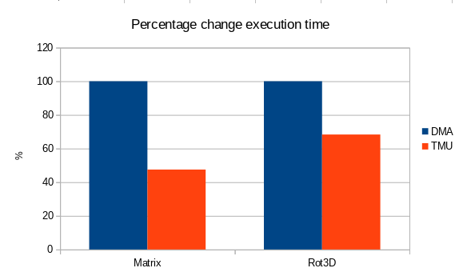
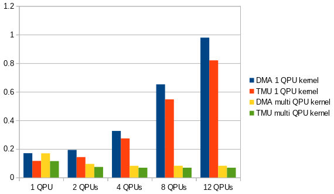

<head>
	<link rel="stylesheet" type="text/css" href="../css/docs.css">
</head>

# Comparing VPM and TMU

The following statements are the standard syntax used for transferring a 16-vector
(a block of 16 float or int values, size 64 bytes) between QPU and main memory:

    a = *ptr;
    *ptr = a;

On `vc4`, VPM was used for this by default. 
I have lived under the assumption that VPM is faster than TMU, due to online hearsay,
but I have now taken the time to check it.

I took two IO-intensive kernels and changed the memory access to TMU while keeping
the rest of the logic intact. This is the result:

It turns out that TMU usage is actually faster.

I examined further combinations as well with multiple QPU's:

*Various execution combinations for kernel Rot3D*

To be honest, I was expecting more of a difference here between VPM and TMU.
I expected TMU to be vastly better here.

Of special note is that with kernels not optimized for multi-QPU usage, performance actually gets
worse if more QPUs are added.

In any case, the conclusion is inescapable:

**For regular usage, TMU is always faster than VPM**

It might be the case that TMU is still faster if more than one 16-vector is loaded per go,
but I'm not going there.

Based on this, I am making TMU usage the default for `vc4`. DMA will still be supported and checked in
the unit tests.
