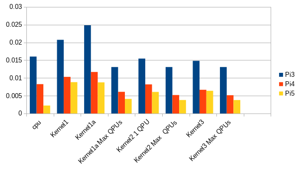

<head>
	<link rel="stylesheet" type="text/css" href="../css/docs.css">
</head>

# Rot3D Profiling

Updated this on **20260202** to add `pi5` and to adjust values for current version of library.

At time of writing, there were several `Rot3D` kernels present.  
The original performance comparison was to argue that the `gather-receive` usage was better
than naive read-write. This turns out to be only true for `vc4`, because it needs to use DMA.

**NOTE:** TMU-write is now default. This probably skews the recent results.

The secondary aim of this profiling to select the best all-round kernel.

`Rot3D` is IO-bound.
Example `Mandelbrot` had a much better compute-to-memory ratio, and is therefore a better candidate for
measuring computing performance with respect to scaling.

## Kernels

### Scalar version

The following function will rotate `n` vertices about the Z axis by
&theta; degrees.

    void rot3D(int n, float cosTheta, float sinTheta, float* x, float* y) {
      for (int i = 0; i < n; i++) {
        float xOld = x[i];
        float yOld = y[i];
        x[i] = xOld * cosTheta - yOld * sinTheta;
        y[i] = yOld * cosTheta + xOld * sinTheta;
      }
    }

### Vector version 1

This first vector version is almost identical to the scalar version above.
The only difference is that each loop iteration now processes 16 vertices at a time rather than a single vertex.

    void rot3D_1(Int n, Float cosTheta, Float sinTheta, Float::Ptr x, Float::Ptr y) {
      For (Int i = 0, i < n, i += 16)
        Float xOld = x[i];
        Float yOld = y[i];
        x[i] = xOld * cosTheta - yOld * sinTheta;
        y[i] = yOld * cosTheta + xOld * sinTheta;
      End
    }

This simple solution will spend a lot of time blocking on the memory subsystem, waiting for vector reads and write to complete.
The next section explores how to improve performance by overlapping memory access with computation.

### Vector 1a : multi-QPU impementation

This basically takes the previous single-QPU kernel and make it multi-kernel.

    void rot3D_1a(Int n, Float cosTheta, Float sinTheta, Float::Ptr x, Float::Ptr y) {
    
      Int step = numQPUs() << 4;
      x += me()*16;
      y += me()*16;

      auto read = [] (Float &dst, Float::Ptr &src) {
        dst = *src;
      };

      For (Int i = 0, i < n, i += step)
        Float xOld;
        Float yOld;
    
        read(xOld, x);
        read(yOld, y);
    
        x[i] = xOld * cosTheta - yOld * sinTheta;
        y[i] = yOld * cosTheta + xOld * sinTheta;
    
        x += step;
        y += step;
      End
    

### Vector version 2: non-blocking memory access 

`V3DLib` supports explicit non-blocking loads through these functions:

| Operation        | Description                                                                  |
|------------------|------------------------------------------------------------------------------|
| `gather(p)`      | Given a vector of addresses `p`, *request* the value at each address in `p`. |
|                  | A maximum of 8 gather calls can be outstanding at any one time.              |
|                  | For more than 8, the QPU will block *(TODO verify)*.                         |
| `receive(x)`     | Loads values collected by `gather(p)` and stores these in `x`.               |
|                  | Will block if the values are not yet available.                              |
| `prefetch(x, p)` | Combines `gather` and `receive` in an efficient manner. `gather` is          |
|                  | performed as early as possible. There are restrictions to its usage *(TODO)* |

These are all read operations, the write operation can not be optimized.

 - On `vc4` a write operation has to wait for a previous write operation to complete.
 - On `v3d`, a write operation does not block and always overlaps with QPU computation.

Between `gather(p)` and `receive(x)` the program is free to perform computation *in parallel*
with the memory accesses.

Inside the QPU, an 8-element FIFO, called the **TMU**, is used to hold `gather` requests:
each call to `gather` will enqueue the FIFO, and each call to `receive` will dequeue it.
This means that a maximum of eight `gather` calls may be issued before a `receive` must be called.

A vectorised rotation routine that overlaps memory access with computation might be as follows:

    void rot3D_2(Int n, Float cosTheta, Float sinTheta, Float::Ptr x, Float::Ptr y) {
      Int inc = numQPUs() << 4;
      Float::Ptr p = x + me()*16;
      Float::Ptr q = y + me()*16;
    
      gather(p); gather(q);
     
      Float xOld, yOld;
      For (Int i = 0, i < n, i += inc)
        gather(p+inc); gather(q+inc); 
        receive(xOld); receive(yOld);
    
        *p = xOld * cosTheta - yOld * sinTheta;
        *q = yOld * cosTheta + xOld * sinTheta;
        p += inc; q += inc;
      End
    
      receive(xOld); receive(yOld);
    }

While the outputs from one iteration are being computed and written to
memory, the inputs for the *next* iteration are being loaded *in parallel*.

Variable `inc` is there to take into account multiple QPU's running.
Each QPU will handle a distinct block of 16 elements.

### Vector Kernel version 3

This kernel combines `gather-recieve` with mult-QPU's.
Logically, it is not much different from Kernel 2.

    namespace {
      int N       = -1;  // Number of elements in incoming arrays for rot3D_3
      int numQPUs = -1;  // Number of QPUs to use for rot3D_3
    }  // anon namespace
    
    
    void rot3D_3(Float cosTheta, Float sinTheta, Float::Ptr x, Float::Ptr y) {
      assert(N != -1);
      assert(numQPUs != -1);
      assertq(N % (16*numQPUs) == 0, "N must be a multiple of '16*numQPUs'");

      int size = N/numQPUs;
      Int count = size >> 4;

      Int adjust = me()*size;
    
      Float::Ptr p_src = x + adjust;
      Float::Ptr q_src = y + adjust;
      Float::Ptr p_dst = x + adjust;
      Float::Ptr q_dst = y + adjust;
    
      gather(p_src, q_src);
    
      Float x_prev, y_prev;
    
      For (Int i = 0, i < count, i++)
        receive(x_prev, p_src);
        receive(y_prev, q_src);
    
        *p_dst = x_prev * cosTheta - y_prev * sinTheta;
        *q_dst = y_prev * cosTheta + x_prev * sinTheta;
    
        p_dst.inc();
        q_dst.inc();
      End
    
      receive();
    }

-----

## Profiling Values

All runs were done with 192,000 vertices. The vertices are 2D in the XY-plane and rotated around
the z-axis.  
Values are the median of at least 5 runs.

|	    |cpu       | Kernel1	 | Kernel1a	 | Kernel1a Max QPUs	| Kernel2 1 QPU	| Kernel2 Max QPUs | Kernel3  | Kernel3 Max QPUs |
|-----|----------|-----------|-----------|--------------------|---------------|------------------|----------|------------------|
| Pi3 | 0.016009 | 0.020724  | 0.024813  | 0.013057           | 0.015441      | 0.013057         | 0.014803	| 0.013066         |
| Pi4 | 0.00825  | 0.010297  | 0.011673  | 0.006082           | 0.008178      | 0.005183         | 0.006655	| 0.005126         |
| Pi5 | 0.002224 | 0.008812  | 0.008748  | 0.004084           | 0.006057      | 0.003775         | 0.006365	| 0.003766         |

- The original conclusion is:

> **Non-blocking loads (Kernel 2) give a significant performance boost: in this case a factor of 2.**

This is totally true for `vc4`. For `v3d` this does not really hold. Nifty coding can compensate.
See kernel 1a.

- Note that the performance does not increase much when using multiple kernels for
  kernel versions > 1. This is totally an indication that the calculation is _IO-bound_.
- The best all-round kernel is **1a**, which will be used further. Of special interest,
  this kernel does _not_ use `gather-receive`, but performs well anyway. 
	By the time you read this, all other kernels mentioned will be removed.
- Of special note, on `pi5` the scalar kernel of `Rot3D`,  which is plain naive,
_absolutely kills the QPU kernels_.  
This can be explained by noting that the kernel is **IO-intensive**,
meaning that the data transfer largely overwhelms the computations.  
Nevertheless, it is worrying. What's the use of programming for the QPU's if the CPU performs better?
