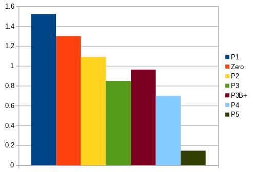
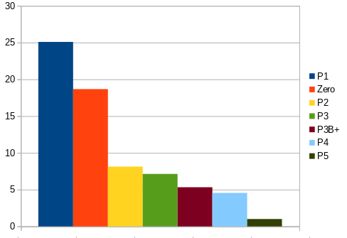

<head>
	<link rel="stylesheet" type="text/css" href="../css/docs.css">
</head>

# Mandelbrot Performance

The `Mandelbrot` app is a pretty good indicator of performance, because it is **compute-bound**.

## GPU

- DEBUG compile
- Max QPUs selected, all other options default (no file output)
- Median of of several values
- Kernel compile not counted, only kernel run time

*Values in s*

| P1       | Zero     | P2       | P3       | P3B+     | P4       | P5       |
|----------|----------|----------|----------| -------- | ---------|----------|
| 1.523748 | 1.300062 | 1.090135 | 0.849228 | 0.962436 | 0.699729 | 0.146146 |

The time for `Pi3B+` is disappointing;
this is the first application compiled on `Debian 13 (trixie)`; 
perhaps there is a connection.

-----

## CPU

- DEBUG compile
- Median of of several values

*Values in s*

| P1       | Zero      | P2       | P3       | P4       | P5       |
|----------|-----------|----------|----------|----------|----------|
| 25.08893 | 18.669549 | 8.127472 | 7.133643 | 4.546643 | 1.000233 |

-------------------------------

## Discussion

`Pi5` is killing the other Pi's. It is faster for both GPU and CPU by at least a factor
of four.  
In fact, the `Pi5` CPU value is better than the GPU values for `Pi1`, `Zero` and `Pi2`,
even though the implementation is simplistic and _single-threaded_.
